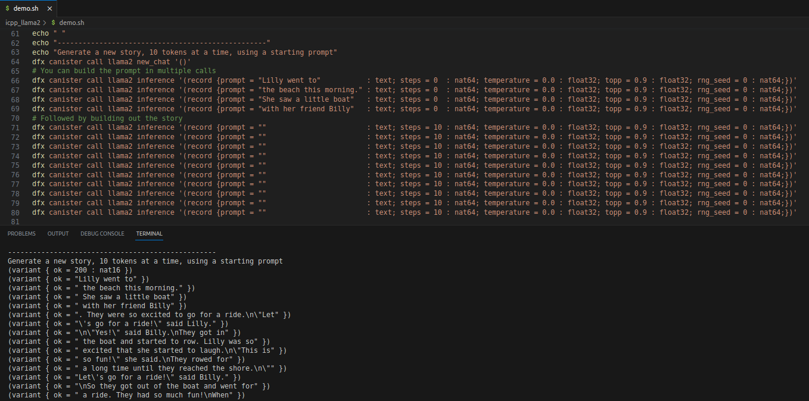

# [karpathy/llama2.c](https://github.com/karpathy/llama2.c) for the Internet Computer

# Instructions

- Install the C++ development environment for the Internet Computer ([docs](https://docs.icpp.world/installation.html)):
  - Install the required python packages *(icpp-pro & ic-py)*:
    ```bash
    pip install -r requirements.txt
    ```
  - Install the [wasi-sdk](https://github.com/WebAssembly/wasi-sdk) compiler:
    ```bash
    icpp install-wasi-sdk
    ```
  - Install dfx:
    ```bash
    sh -ci "$(curl -fsSL https://internetcomputer.org/install.sh)"
    ```
    *(Note: On Windows, just install dfx in wsl, and icpp-pro in PowerShell will know where to find it. )*
    

- Get a model checkpoint, as explained in [karpathy/llama2.c](https://github.com/karpathy/llama2.c):

   This command downloads the 15M parameter model that was trained on the TinyStories dataset (~60MB download) and stores it in a `models` folder:

   ```bash
   # on Linux/Mac
   mkdir -p models
   wget -P models https://huggingface.co/karpathy/tinyllamas/resolve/main/stories15M.bin
   ```

   ```powershell
   # in Windows PowerShell (Miniconda recommended)
   if (-not (Test-Path -Path .\models)) {
    New-Item -Path .\models -ItemType Directory
   }
   Invoke-WebRequest -Uri https://huggingface.co/karpathy/tinyllamas/resolve/main/stories15M.bin -OutFile .\models\stories15M.bin
   ```

- The demo_pytest.sh script starts the local network, deploys llama2_260K, uploads the model & tokenizer, and runs the QA with pytest:
  - `./demo_pytest.sh`  , on Linux / Mac

- The *demo* script starts the local network, deploys llama2, uploads the model & tokenizer, and generates two stories:
  - `./demo.sh`  , on Linux / Mac
  - `.\demo.ps1` , in Windows PowerShell (Miniconda recommended)

​        This screenshot shows the generation of the second story:



- To deploy all the LLM canisters and upload their models + tokenizers:
  ```bash
  # ---------------------------------------------------------------
  # Build WASM & deploy 
  icpp build-wasm
  dfx deploy

  # Set the canister mode to either 'chat-principal' or 'nft-ordinal'
  # for normal LLMs
  dfx canister call llama2_260K set_canister_mode chat-principal
  dfx canister call llama2      set_canister_mode chat-principal
  dfx canister call llama2_42M  set_canister_mode chat-principal
  dfx canister call llama2_110M set_canister_mode chat-principal

  # for NFT LLMs controlled by bitcoin ordinals
  dfx canister call <...>     set_canister_mode nft-ordinal

  # ---------------------------------------------------------------
  # Call `nft_init`
  
  # For the ICGPT backend canisters, minting is not supported:
  python -m scripts.nft_init --network local --canister llama2_260K --nft-supply-cap 0 --nft-symbol "" --nft-name "" --nft-description ""
  python -m scripts.nft_init --network local --canister llama2      --nft-supply-cap 0 --nft-symbol "" --nft-name "" --nft-description ""
  python -m scripts.nft_init --network local --canister llama2_42M  --nft-supply-cap 0 --nft-symbol "" --nft-name "" --nft-description ""
  python -m scripts.nft_init --network local --canister llama2_110M --nft-supply-cap 0 --nft-symbol "" --nft-name "" --nft-description ""

  # For an NFT canister: Initialize the NFT Collection
  python -m scripts.nft_init --network local --canister <...> --nft-supply-cap <...> --nft-symbol "..." --nft-name "..." --nft-description "..." 

  # ---------------------------------------------------------------
  # Upload the models & tokenizers to the canisters
  # Notes:
  # (-) The storiesXX.bin files are not included in the github repo
  # (-) See `Get a model checkpoint` above
  # (-) The default tokenizer.bin is included in the github repo
  # (-) See `stories260k` below how to build the tok512.bin for the stories260K model
  # (-) Use `--network ic` when deploying to mainnet
  #
  # IMPORTANT: ic-py will through a timeout => patch it here:
  # /home/arjaan/miniconda3/envs/icpp-pro-w-llama2/lib/python3.11/site-packages/httpx/_config.py
  # # DEFAULT_TIMEOUT_CONFIG = Timeout(timeout=5.0)
  # DEFAULT_TIMEOUT_CONFIG = Timeout(timeout=99999999.0)
  # And perhaps here:
  # /home/arjaan/miniconda3/envs/<your-env>/lib/python3.11/site-packages/httpcore/_backends/sync.py#L28-L29
  with map_exceptions(exc_map):
            # PATCH AB
            timeout = 999999999
            # ENDPATCH
            self._sock.settimeout(timeout)
            return self._sock.recv(max_bytes)
  
  # The ICGPT backend canisters
  python -m scripts.upload --network local --canister llama2_260K --model stories260K/stories260K.bin --tokenizer stories260K/tok512.bin

  python -m scripts.upload --network local --canister llama2 --model models/stories15Mtok4096.bin --tokenizer tokenizers/tok4096.bin

  python -m scripts.upload --network local --canister llama2_42M --model models/stories42Mtok4096.bin --tokenizer tokenizers/tok4096.bin

  python -m scripts.upload --network local --canister llama2_110M --model models/stories110M.bin --tokenizer tokenizers/tokenizer.bin

  #
  # The NFT canister
  python -m scripts.upload --network local --canister <...> --model <...> --tokenizer <...>

  # ---------------------------------------------------------------
  # For an NFT canister: mint the NFTs
  => TODO
  
  # ---------------------------------------------------------------
  # Run tests
  pytest
  
  ```

# stories260K

The default model is `stories15M.bin`, with `tokenizer.bin`, which contains the default llama2 tokenizer using 32000 tokens. 

For testing, it is nice to be able to work with a smaller model & tokenizer:
- Download the model & tokenizer from [huggingface stories260K](https://huggingface.co/karpathy/tinyllamas/tree/main/stories260K) and store them in:
  - stories260K/stories260K.bin
  - stories260K/tok512.bin
  - stories260K/tok512.model
- Deploy the canister:
  ```bash
  icpp build-wasm
  dfx deploy
  ```
- Upload the model & tokenizer:
  ```bash
  python -m scripts.upload --canister llama2_260K --model stories260K/stories260K.bin --tokenizer stories260K/tok512.bin
  ```
- Inference is now possible with many more tokens before hitting the instruction limit, but off course, the stories are not as good:
  ```bash
  # Create a new chat
  $ dfx canister call llama2_260K new_chat '()'

  # Start the chat by providing the starting prompt
  $ dfx canister call llama2_260K inference '(record {prompt = "Lilly went swimming yesterday  " : text; steps = 100 : nat64; temperature = 0.9 : float32; topp = 0.9 : float32; rng_seed = 0 : nat64;})'
  (
    variant {
      Ok = "Lilly went swimming yesterday  order. She had a great eyes that was closed. One day, she asked her mom why the cloud was close to the pond. \n\"Mommy, I will take clothes away,\" Lila said. \"Th\n"
    },
  )

  # Continue the current chat by calling again, with an empty prompt
  $ dfx canister call llama2_260K inference '(record {prompt = "" : text; steps = 100 : nat64; temperature = 0.9 : float32; topp = 0.9 : float32; rng_seed = 0 : nat64;})'
  (
    variant {
      Ok = "eone replace it.\nThe fox agreed to go as fast as they set on the other birds. They searched, and it didn\'t give up. They started to scared the bird. The forest was so careful and jumped up."
    },
  )

  # Retrieve your full story, by calling with curl, passing the principal by which the LLM knows you in the body
  $ dfx canister call llama2_260K whoami
  '("<your-principal>")'

  $ curl -X GET -d '{"principal":"<your-principal>"}' http://localhost:$(dfx info webserver-port)?canisterId=$(dfx canister id llama2_260K)

  ```

# Run llama2.c natively

To do some prompt testing, it is nice to run llama2.c directly from the llama2.c github repo.

```bash
git clone https://github.com/icppWorld/llama2.c
cd llama2.c

conda create --name llama2-c python=3.10
conda activate llama2-c
pip install -r requirements.txt

make run

# Example command
./run models/stories15Mtok4096.bin -z tokenizers/tok4096.bin -t 0.1 -p 0.9 -i "Tony went swimming on the beach"
```

# Fine tuning

  When making your own checkpoint via fine-tuning, make sure to train with the correct version of [karpathy/llama2.c](https://github.com/karpathy/llama2.c):

  | release | commit sha                                |
  | --------| ----------------------------------------- |
  | 0.1.0   |  b28c1e26c5ab5660267633e1bdc910a43b7255bf |
  | 0.2.0   |  57bf0e9ee4bbd61c98c4ad204b72f2b8881ac8cd |
  | 0.3.0   |  b9fb86169f56bd787bb644c62a80bbab56f8dccc |